# Object_Boss

- [ゲームについて](#ゲームについて)
  - [開発計画](#開発計画) 
  - [ゲーム説明](#ゲーム説明) 
  - [スキル設定](#スキル設定)
- [リソースの参考](#リソースの参考)
  - [美術参考](#美術参考)
  - [素材処理](#素材処理)
- [ストーリー](#ストーリー)
- [まとめ](#まとめ)
- [ゲームアーキテクチャ設計](#ゲームアーキテクチャ設計)
  - [AssetManager](#AssetManager)

- []()
  - []()
- [作者](#作者)

## ゲームについて
### 開発計画
- ゲームストーリーデザイン
  - [ ] 教程（チュートリアル）ステージの設計
  - [ ] チュートリアル中の演出効果の実装（カメラ、テキスト、BGMなど）

- ゲームメインメニュー設計
  - メニュー機能
    - [ ] 「新しいゲーム」実装（チュートリアル付き）
    - [ ] 「続きから」実装（チュートリアルなしで直接Boss戦へ）
    - [ ] 「ゲーム説明」実装（結界の組み合わせ効果を解説）
    - [ ] 「終了」ボタン実装

  - ビジュアル・サウンドデザイン
    - [ ] メインメニュー背景画像の制作または収集
    - [ ] メインメニューBGMの制作または収集

  - チュートリアルステージ
    - [ ] プレイヤーの移動方法を説明するUI／演出の作成
    - [ ] 結界効果の基本説明（簡単な実演付き）
    - [ ] ストーリー演出（カメラ、エフェクト、セリフなど）の実装

- Boss戦ステージ
  - [ ] Bossの移動パターン設計
  - [ ] Bossの攻撃パターンと手段の設計（段階的に強化）
  - [ ] Bossの形態変化設計（HPが一定値以下で変化）
  - [ ] ゲーム一時停止機能の実装
  - [ ] 再挑戦機能の実装（Boss戦から再開）

- 勝利演出
  - [ ] 勝利BGMの制作または収集
  - [ ] 勝利シーンの演出（ストーリーやアニメーションなど）

- 敗北演出
  - [ ] 敗北BGMの制作または収集
  - [ ] 敗北シーンの演出（暗転・スロー演出など）

### ゲーム説明
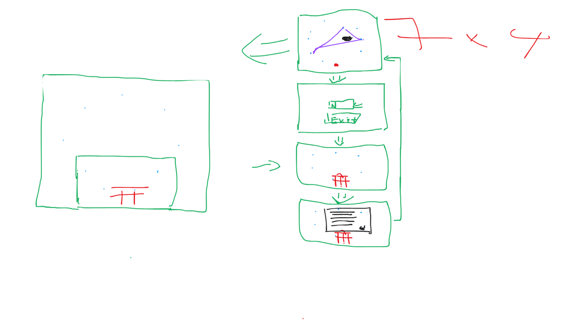


### スキル設定

者 → 皆 → 陣
封陣結界
ボスの移動を約4秒間封じる。


在 → 前 → 臨
時環の輪
敵と弾の動きを約3秒スロー化。


兵 → 闘 → 者
斬魂連撃
ボスに多段ヒットの斬撃を自動発動。


臨 → 在 → 前
転生の祈り
プレイヤーのHPを30％回復or次の被弾無効。


兵 → 皆 → 列
光輪斬
光の刃が周囲を周回し、当たるたびに小ダメージ。

## 美術参考
### プレイヤーのHP
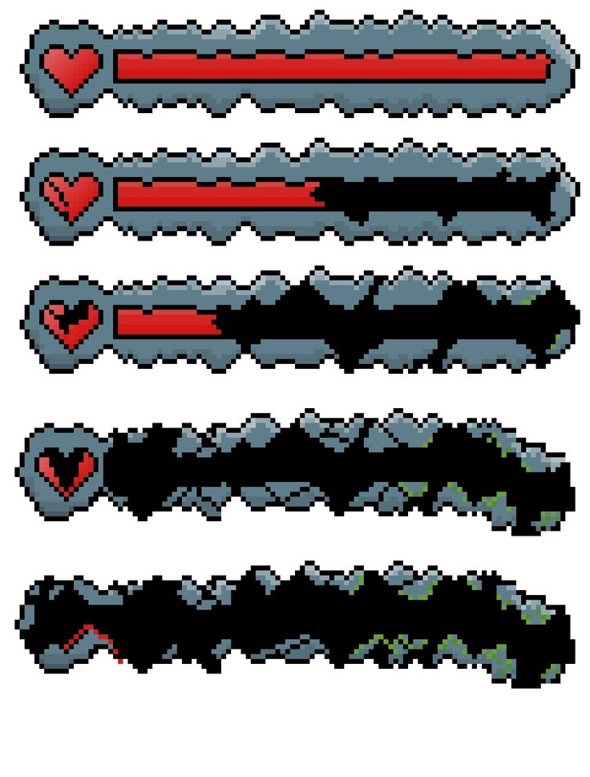

### ボスのHP
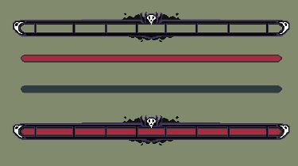


### プレイヤーのアニメーション「Sheet」
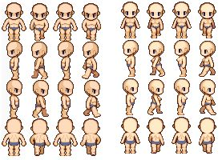
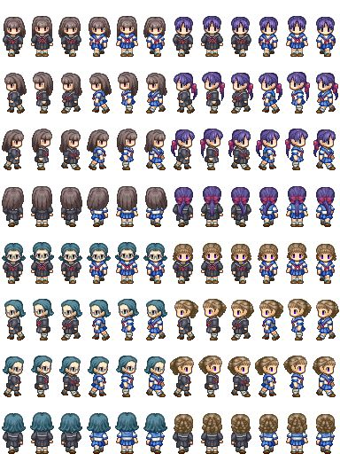
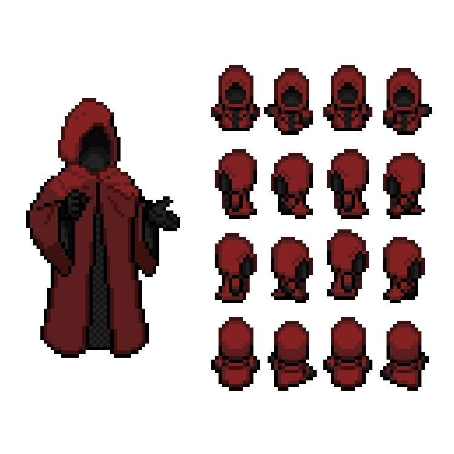

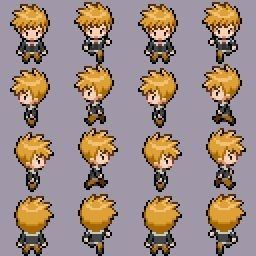

### ボス


### スキル

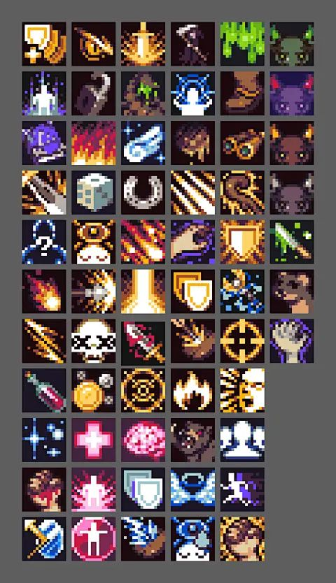

### 鳥居
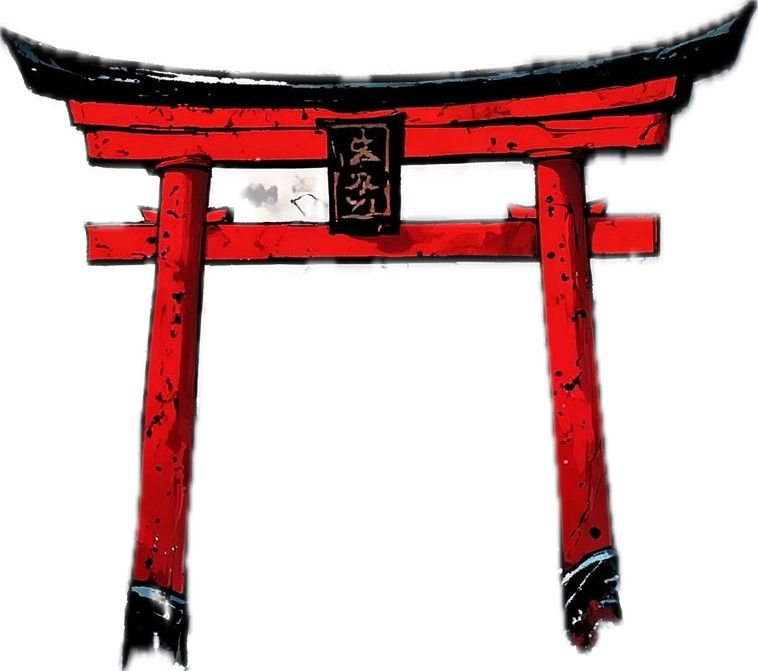


#### 音
##### 音_1


## プログラムについて
### 開発環境
 - Visual Studio 2022

### 環境変数

#### 環境変数
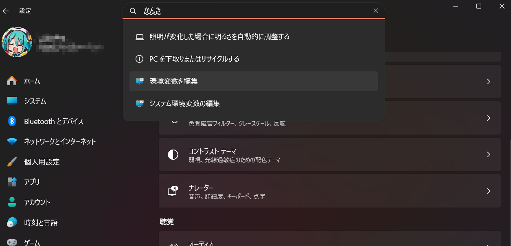

他の方法：
 1. **Windowsキー** を押し、「環境変数」と入力 → **「システム環境変数の編集」** をクリック。
 2. 「システムのプロパティ」ウィンドウが開くので、下部の **「環境変数(N)...」** ボタンをクリック。

#### 環境変数 ``KAMATA_ENGINE`` を設定
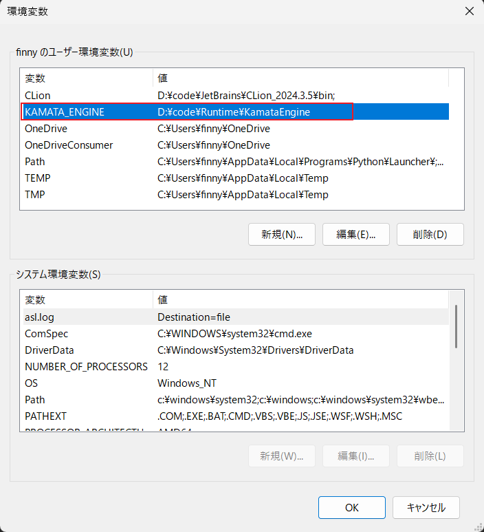

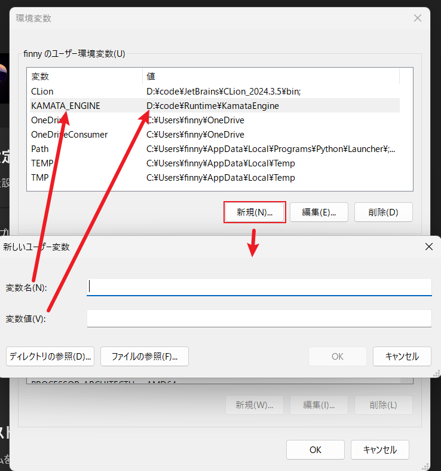
 - **KAMATA_ENGINE** : ``<KamataEngineのパス>``
 - **<KamataEngineのパス>** : ``C:\path\to\KamataEngine`` のように、**KamataEngine** フォルダの絶対パスを指定。

#### テストする
**PowerShell**の方は：
```powershell
echo $env:KAMATA_ENGINE
```
**コマンドプロンプト**の方は：
```cmd
echo %KAMATA_ENGINE%
```
パスが表示されれば成功です。
### コンパイラの「インクルードパス」を設定
``include/`` 配下のヘッダーファイルを直接見つけられるようにする：

 1. プロジェクトを右クリック → ``Properties``（プロパティ）。
 2. 左ペインで ``Configuration Properties → C/C++ → General`` を選択。
 3. Additional Include Directories に次を追加：
```
$(ProjectDir)include;
```

``$(ProjectDir)`` マクロを使うと、絶対パスのハードコードを避けられます。階層が深い場合は ``$(SolutionDir)libs\engine\include`` などに変更してください。
左上の **Configuration** は **「All Configurations」、Platform** は **「All Platforms」** を選択すると、**Debug/Release、Win32/x64** の両方に適用されます。

## ストーリー


## まとめ：
 - 時間の都合により、データドリブンの原則を完全には適用できず、UI は依然としてコードにハードコーディングされている。今後の改善が必要。
 - SceneManager が設定データ（JSON）を読み込む部分については、いわゆる「悪いコード（コードの臭い）」が残っている状態。
 - 現在の gEngine は生のグローバル変数になっており、典型的な「悪いコード（コードの臭い）」が強い設計になっている。修正は必要がある。
 - 現在、各シーンで使用している *Manager は、エンジンから直接呼び出している。このような使い方は避けるべきで、本来はコンストラクタ経由で渡すべき。
 - GameMap の JSON 構造には大きな問題があります。レイヤー単位での描画を前提にした場合、tiles については意図どおりにレイヤー分けして描画できますが、decorations に関してはオブジェクトごとに分けて描画したり、レイヤーを分けて管理したりすることができません。現在の仕様では、decorations に入っているオブジェクトはすべて同一レイヤーとして扱われてしまうため、描画順や前後関係を細かく制御できない構造になっています。
この点は設計レベルの問題であり、JSON 構造自体を見直して修正する必要があります。


## ゲームアーキテクチャ設計

### AssetManager
```
┌──────── GameApp / Game Systems ─────────┐
│   Handle<AnimationData> ...             │
│   Handle<Texture> ...                   │
│   Handle<Sound> ...                     │
│   Handle<TileSet> ...                   │
└────────────────────┬────────────────────┘
                     │ A)
       ┌─────────────▼──────────────┐
       │       AssetManager         │
       │  - AssetCatalog catalog    │
       │  - map<id, resource> cache │
       │  - map<type, IAssetLoader> │
       └──────┬─────────┬───────────┘
              │         │
           B) │         │ C)
              │         │
   ┌──────────▼────┐  ┌─▼────────────────┐
   │ AssetCatalog  │  │ IAssetLoader<T>  │
   │ id→{type,path}│  │  ↑   ↑   ↑   ↑   │
   └───────────────┘  │  │   │   │   │   │
                      └──│───│───│───│───┘
    TextureLoader   ◄────┘   │   │   │
    SoundLoader     ◄────────┘   │   │
    AnimationLoader ◄────────────┘   │
    TileSetLoader   ◄────────────────┘

A）Game Systems が AssetManager を使用してリソースを取得する

B）AssetManager は AssetCatalog を参照してリソースパスを取得し、対応する IAssetLoader を呼び出して読み込み処理を行う。

C）AssetManager は各リソース種類に対応した IAssetLoader の具体的な実装を用いて、異なるタイプのリソースを読み込む。

```

### SceneManager
```
```

#### SceneChangeParam Code Table (例)
| Key         | Type | Description | Example |
|-------------|------|-------------|---------|
| levelId     | str  | 読み込むレベル（関卡）ID           | "level_01" |
| result      | str  | 戦闘結果（win / lose）     | "win" |
| xp          | int  | 獲得した経験値              | "150" |
| killed      | int  | 撃破した敵の数             | "23" |
| saveSlot    | int  | 使用したセーブスロット番号           | "2" |
| dialogId    | str  | 再生する会話スクリプトのID        | "dlg_03" |


## 作者
日本工学院専門学校
[]()
[]()
[]()
[]()
